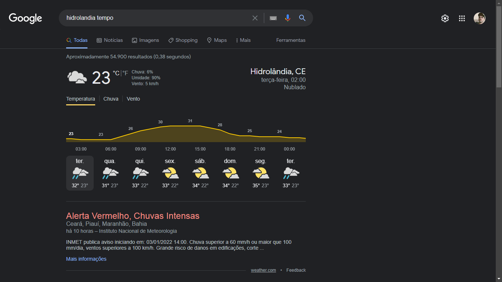

# Temperatura - Clone do tempo do Google

> Esse projeto, trata-se de um clone da página de previsão do tempo do google. Ele foi desenvolvido com base no conhecimento adquirido do bootcamp do banco **Inter**. Vale ressaltar, que esse projeto consome dados de uma api de previsão de tempo - [Weather API](https://www.weatherapi.com/docs/).

## :camera_flash: Inspiração

## :camera_flash: Versão Desktop

## :camera_flash: Versão Mobile

## :hammer_and_wrench: Tecnologias utilizadas
 Foram utilizadas as segintes ferramentas no desenvolvimento:
 - HTML
 - JS
 - CSS

## :nerd_face: Aprendizados
O que eu aprendi e coloquei em prática, com o desenvolvimento dessa landing page:
 - Divisão do html (header, nav, main e footer);
 - Utilização de fontes externas :link: ([Roboto](https://fonts.googleapis.com/css2?family=Roboto:wght@300;400&display=swap));
 - Flex-box;
 - Eventos em javascript;
 - Manipulação do DOM;
 - FETCH API;
 - Consumo de dados de uma API.

## :page_facing_up: Requisitos
- Qualquer sistema operacional;
- Editor de texto :link: [VS Code](https://code.visualstudio.com/)
- Extensão para o VS Code :link: [Live Server](https://marketplace.visualstudio.com/items?itemName=ritwickdey.LiveServer)
- Browser :link: [Chrome](https://www.google.pt/intl/pt-PT/chrome/?brand=ISCS&gclid=CjwKCAiAtouOBhA6EiwA2nLKHzAVeY7vzxHKqYQHR9e2iF4Q-UYwVeNg_5CdIuPOs6RF2hbwjslc8xoCK3QQAvD_BwE&gclsrc=aw.ds)

## :pencil: Licença
Livre para uso e alteração